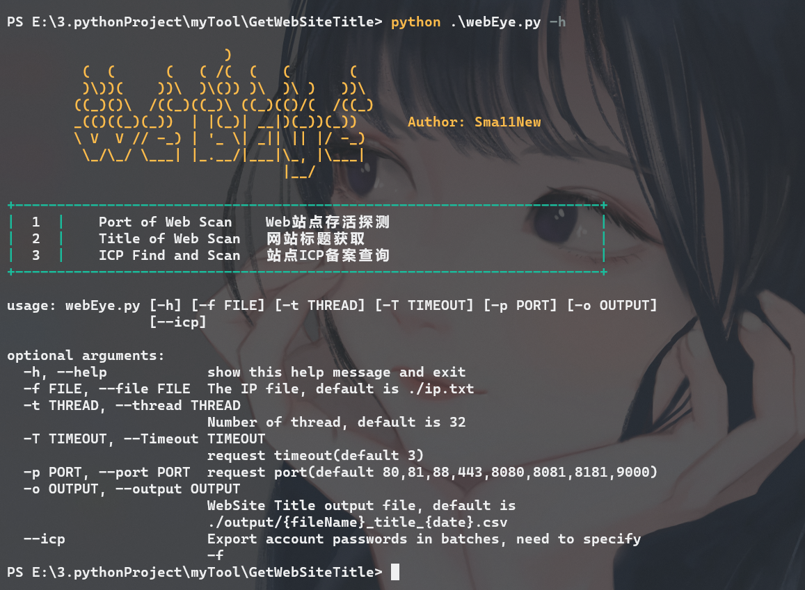
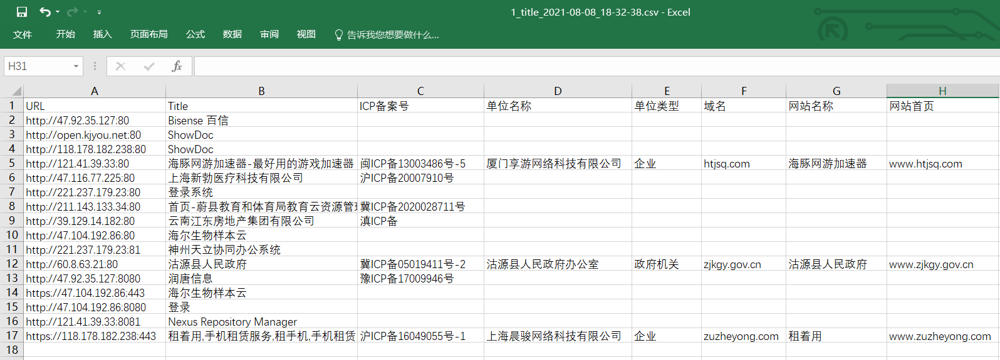

# webEye

**----ps：**

基于该工具改进的利用api反查域名及备案信息已完成，更快更准确更高效：[ip2domain](https://github.com/Sma11New/ip2domain)

----ps end

基于需求，对GetWebSiteTitle进行了二次修改，并更改项目名为**webEye**，用于快速批量检测IP上多个端口是否搭建网站，获取其Title以及**ICP备案信息**，快速确定IP所属单位，取代逐个IP、网站手工归属查询，红队资产探测，可配合 [PocList](https://github.com/Sma11New/PocList) 中的批量POC使用，刷SRC利器！

webEye目前功能及要点：

1.  批量IP的多个端口上Web**存活检测**
2.  获取存活web**站点标题**
3.  获取存活站点ICP备案号，调用接口查询**备案信息**，得到厂商信息及属性
4.  使用**线程池**增加请求速度
5.  查询结果输出至**Excel表格**

webEye目前存在问题：

1.  网站备案号匹配不够精准，导致匹配的备案号存在冗余数据，出现查询备案信息失败
2.  响应中中文乱码导致无法获取备案号
3.  程序逻辑问题，所有查询到的数据临时放在内存，数据量很大时会导致内存占用率较高

后续加以改进。

**开发环境**：Python 3.7、Win10

### Install & Usage

Clone：

```
git clone
```

Module：

```
pip install -r 
```

Usage：

```
python webEye.py [-h] [-f FILE] [-T THREAD] [-t TIMEOUT] [-p PORT] [-o OUTPUT] [--icp]

optional arguments:
  -h, --help      show this help message and exit
  -f, --file      The IP file, default is ./ip.txt   指定要检测的IP地址文件，一行一个IP，默认./ip.txt
  -T, --Thread    Number of thread, default is 32   线程数
  -t, --timeout   request timeout(default 3)   请求超时
  -p, --port      request port(default 80,81,88,443,8080,8081)  待检测端口，可输入常见的Web端口，有默认值
  -o, --output    WebSite Title output file, default is ./output/{fileName}_title_{date}.csv  输出结果
  --icp           Query ICP record information of the website, default False   开启ICP查询，影响速度
```

所有参数均为可选参数，都有默认值，但必须有目标IP文件，默认是./ip,txt，一行一个目标IP，可直接将带协议、端口的地址写入，省去师傅们删掉协议、端口的操作，弟弟在程序里写好了。如（127.0.0.1 或 127.0.0.1:8080 或 http://127.0.0.1:8080）



### Example

**1、**不加--icp，只进行存活探测和Title获取，速度较快

```bash
python webEye.py -f 1.txt
```


大概一个IP用时2秒，具体根据timeout和要检测的IP数、端口数决定，结果均保存至output目录

**2、**加--icp，不只进行存活探测和Title获取，还查询ICP备案信息，速度稍慢

```bash
python webEye.py -f 1.txt --icp
```


大概一个IP用时2.5秒。结果在终端中会显示所属单位类型，像事业单位、政府机构网站，提交漏洞情报收益较大，所有信息输出至Excel表格中：



程序没什么结构性，不过能跑起来、能用的就是好程序，欢迎师傅们使用。
