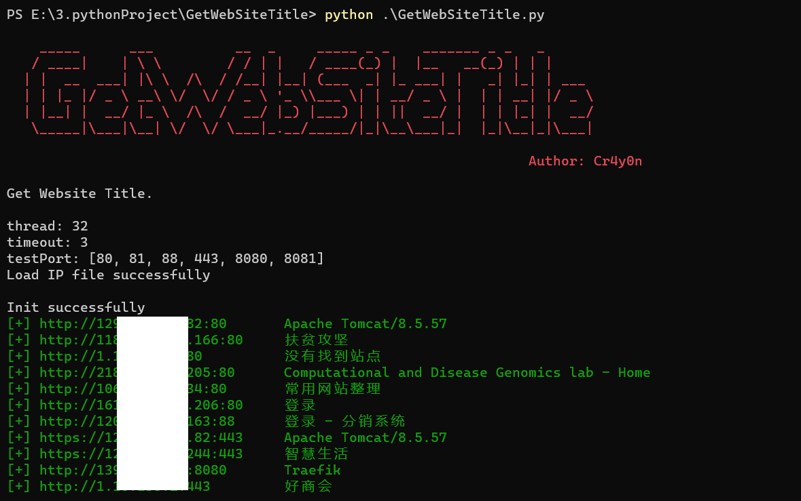
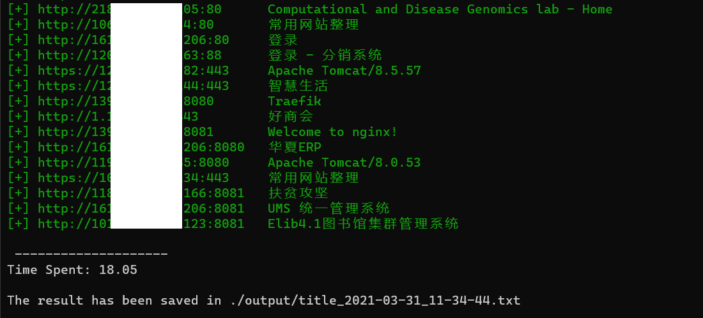

# GetWebSiteTitle

使用多线程方式，批量检测IP上指定端口是否搭建网站，并获取其Title，便于刷SRC时获取IP对应厂商信息，而不用逐个IP搜索。

Python：Python 3

OS：ALL

## Install

clone

```
git clone https://github.com/Cr4y0nXX/GetWebSiteTitle.git
```

or download zip

## Usage

```
GetWebSiteTitle.py [-h] [-f FILE] [-T THREAD] [-t TIMEOUT] [-p PORT] [-o OUTPUT]

optional arguments:
  -h, --help            show this help message and exit
  -f FILE, --file FILE  The IP file, default is ./ip.txt  指定要检测的IP地址文件，一行一个IP，默认./ip.txt
  -T THREAD, --Thread THREAD  Number of thread, default is 32  线程数
  -t TIMEOUT, --timeout TIMEOUT  request timeout(default 3)  请求超时
  -p PORT, --port PORT  request port(default 80,81,88,443,8080,8081)  要检测的端口，可输入常见的Web服务端口，有默认值
  -o OUTPUT, --output OUTPUT
                        WebSite Title output file, default is
                        ./output/title_2021-03-31_10-54-28.txt  输出结果
```

所有参数均为可选参数，都有默认值，但必须有目标IP文件，默认是./ip,txt，一行一个目标IP，可直接将带端口的目标写入，省去师傅们删掉端口的操作，弟弟在程序里写好了。如（127.0.0.1 或 127.0.0.1:8080）

## Example

```
python GetWebSiteTitle.py
```



大概一个IP用时1秒，具体根据timeout和要检测的端口数决定，结果均保存至output目录



