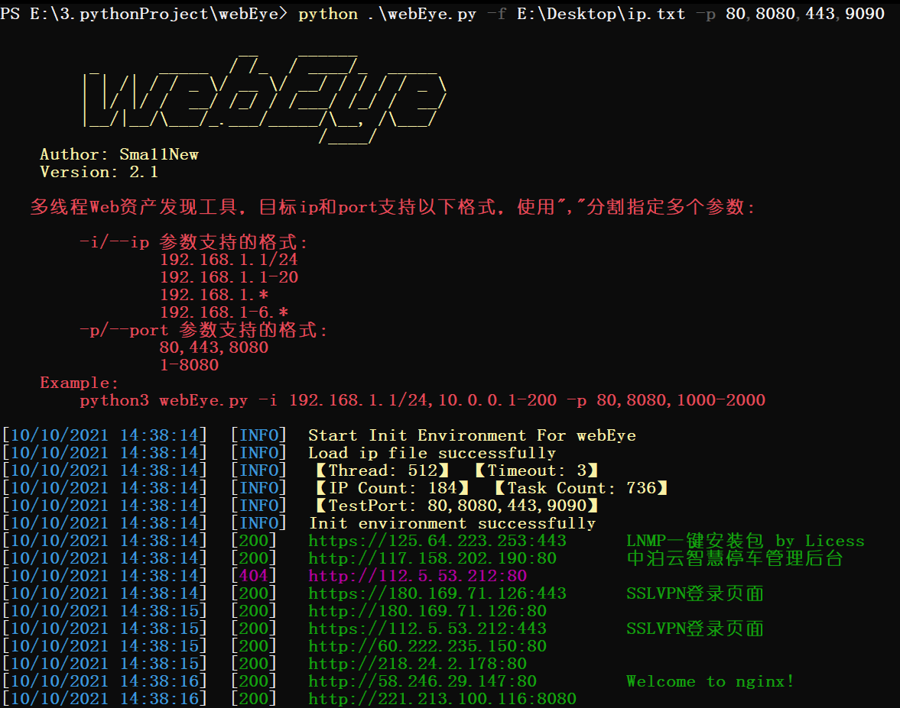

# webEye `(v2.1)` - web资产探测

**PS：全新版本的批量ip反查域名及备案信息工具已完成，更快更准确更高效：[ip2domain](https://github.com/Sma11New/ip2domain)**

### 更新日志：

#### **2021-10-10 `(v2.1)`：**

-   删除ICP备案查询功能
-   优化数据输入输出，加入解析多种ip和port格式，增加支持-p/--ip参数直接输入目标ip/ip段
-   加入任务进度，更加直观
-   修复已知问题

#### **2021-08-08 `(v2.1)`：**

-   修改项目名为webEye
-   加入ICP备案查询

#### **2021-02-13 `(v1.0)`：**

-   可读取文件ip列表进行简单的web资产探测

### 功能简述

**webEye工具专项于ip对应web资产探测，可用于红队信息搜集、蓝队内网web资产探测梳理。**

**webEye目前功能及要点：**

1.  批量IP的多个端口上Web**存活检测**
2.  获取存活web**站点标题**
3.  获取指定多个响应码的web资产
4.  使用**线程池**增加请求速度
5.  查询结果输出至**Excel表格**

**开发环境**：Python 3.7、Win10

### 2、Install & Usage

下载项目

```
git clone https://github.com/Sma11New/webEye.git
```

安装依赖

```
pip install -r requirements.txt
```

参数说明：

```
webEye.py [-h] [-i IP] [-f FILE] [-p PORT] [-t THREAD] [-T TIMEOUT] [-o OUTPUT]

optional arguments:
  -h, --help                     show this help message and exit
  -i IP, --ip IP                 Target ip, eg:127.0.0.1/24  【目标ip】
  -f FILE, --file FILE           Target ip list file   【ip列表文件】
  -p PORT, --port PORT           request port (default 80,81,88,443,4430,8080,8081,8181,8443,9000) 【目标端口】
  -t THREAD, --thread THREAD     Number of thread (default 512) 【线程，默认512】
  -T TIMEOUT, --Timeout TIMEOUT  Request timeout (default 3) 【请求超时，默认3】
  -o OUTPUT, --output OUTPUT     Output file (default ./output/webEye_title_{date}.csv)
```

#### **webEye支持的ip、port参数格式：**

-i/--ip 参数支持的格式：

-   192.168.1.1/24
-   192.168.1.1-20
-   192.168.1.*
-   192.168.1-6.*

-p/--port 参数支持的格式：

-   80,443,8080
-   1-8080

可使用","隔开一次指定多个，如：`-i 192.168.1.1-20,192.168.1-5.*,10.0.0.1/24`

### 3、Example

参数示例：

```
  python3 webEye.py -i 192.168.1.1/16
  python3 webEye.py -i 192.168.1.1-20,192.168.1-5.* -p 80,8080,100-999
  python3 webEye.py -f ipList.txt -p 1-65535
```

可在命令行中用-i/--ip指定目标ip，支持多种格式和多个参数，使用英文逗号隔开，-p/--port同理

也可将目标ip信息写入文件，一行一个目标ip，支持多种格式，可直接将带协议、端口的地址写入，省去师傅们删掉协议、端口的操作，弟弟在程序里写好了。如（127.0.0.1 或 127.0.0.1:8080 或 http://127.0.0.1:8080）

ipList.txt：

```
192.168.1.1/24
192.168.2.1-200
192.168.1-5.*
```

指定目标ip文件进行web资产探测：

```
python .\webEye.py -f E:\Desktop\ip.txt -p 80,8080,443,9090
```



程序没什么结构性，不过能跑起来、能用的就是好程序，欢迎师傅们使用。
